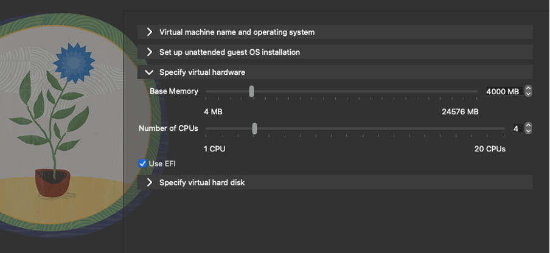
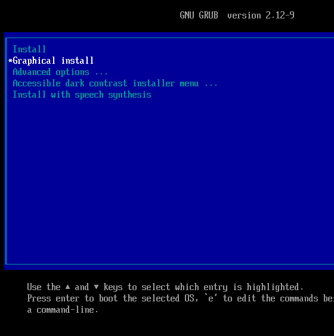
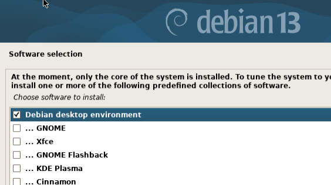
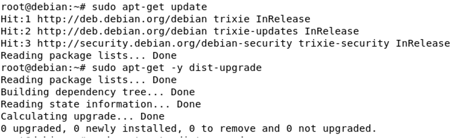

# Debianin asennus virtuaalikoneeseen
Latasin Debianin iso-tiedoston ARM64-versiona, koska käytän MacBook Airia, jossa on ARM-pohjainen M4 siru. Tämän jälkeen asensin VirtualBoxin. Virtuaalikoneen asennus oli hieman erilainen prosessi vaiheineen kuin ohjeissa, koska osiot ja kysymykset vaihtelivat vähän.

Asetin muistin kooksi 4000 MB, ytimien määräksi 4 ja virtuaalikoneen tallennustilaksi 40 GB.

Käynnistin virtuaalikoneen. Valitsin graphical install. Kieli-, näppäimistö- ja käyttäjäasetuksien jälkeen tuli kysymyksiä levyn osioimisesta, joissa otin oletusasetukset sekä ohitin kysymyksen ylimääräisen median asentamisesta.

Valitsin ohjelmistovalinnaksi työpöytäympäristön vakiojärjestelmän työkalujen lisäksi, jotta saan graafisen käyttöliittymän käyttööni.

Käynnistettyäni virtuaalikoneen sain oletus kirjautumisnäkymän näkyville. Virtuaalikone näytti toimivan hyvin sekä Firefox-selain, jota testasin. Tarkistin terminaalin kautta mitä päivitettävää on ja löysin kolme osumaa tälle. Kokeilin päivittää, mutta ei tapahtunut mitään vaan päivityksiä tuli nolla.

Tämän jälkeen latasin ja käynnistin palomuurin, tämä sujui ongelmitta.

# Lähteet

Debian ARM64 ISO, ladattu 18.1.2026. https://www.debian.org/distrib/netinst

Karvinen, Tero 2021: Install Debian on VirtualBox. Haettu 18.1.2026. https://terokarvinen.com/2021/install-debian-on-virtualbox/

Karvinen, Tero 2006: Raportin kirjoittaminen. Haettu 18.1.2026. https://terokarvinen.com/2006/raportin-kirjoittaminen-4/

OpenAI,  ChatGPT (GPT-5), keskustelu 18.1.2026. https://openai.com/ Käytin joidenkin alan termistön sanojen kääntämiseen englannista suomeksi.
