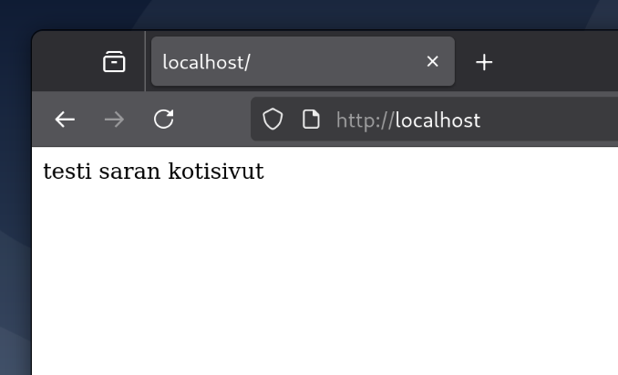
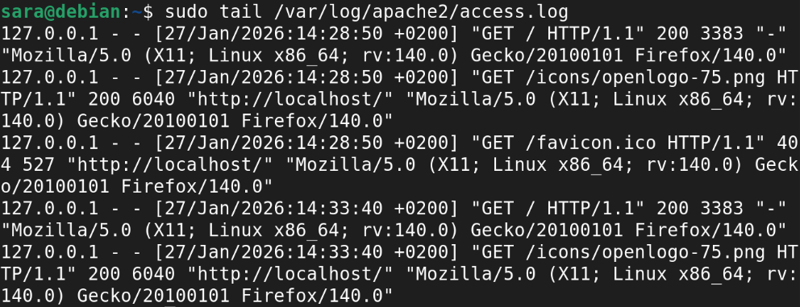
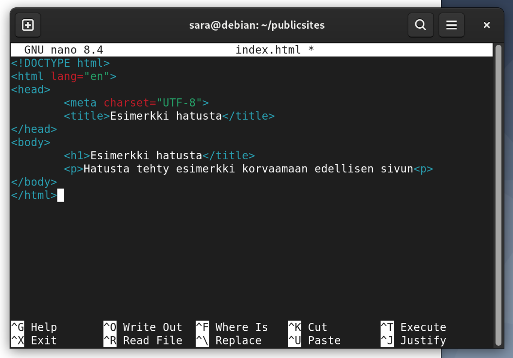
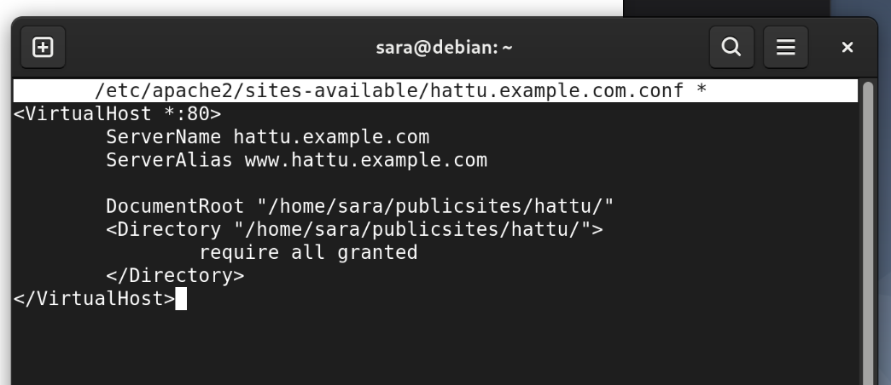
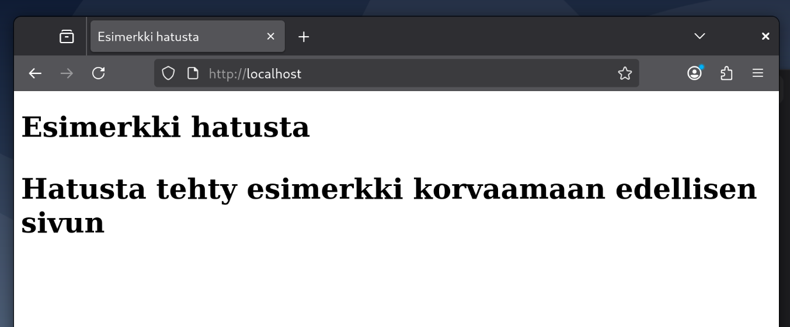
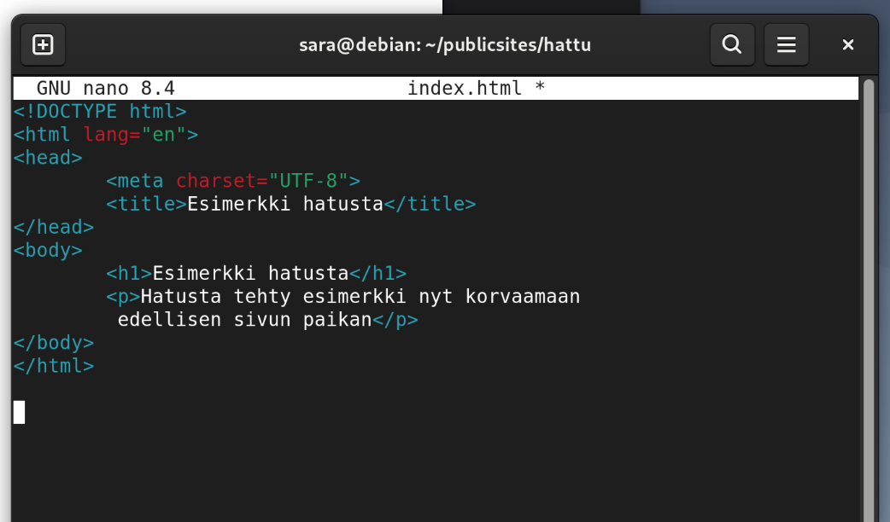
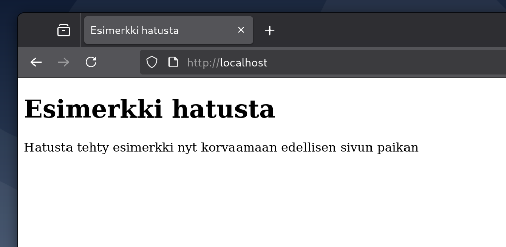
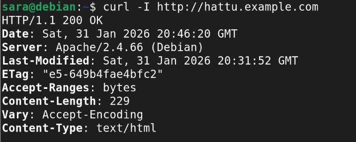
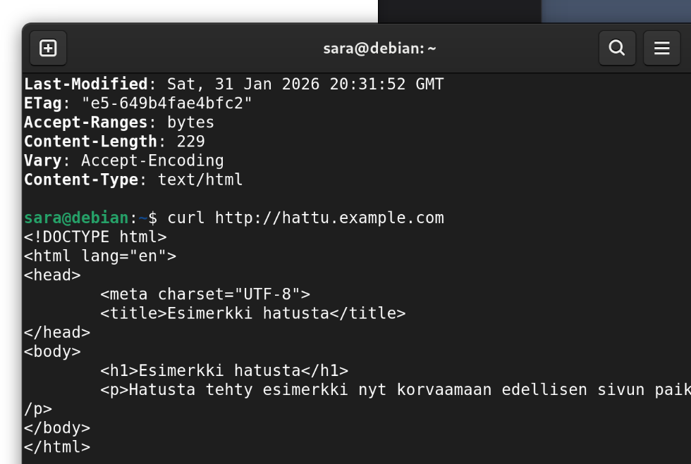

# H3

## x)
[Eka artikkeli](https://httpd.apache.org/docs/2.4/vhosts/name-based.html
)

- Artikkeli kertoo nimeen perustuvien virtuaalihostien hyödyistä verrattuna IP-pohjaisiin (esimerkiksi moni verkkosivu voi tällöin käyttää samaa IP-osoitetta)
- Artikkeli kertoo myös, miten Apache valitsee oikean nimeen perustuvan virtuaalihostin (valitsee pyynnön, jolla on lähin yhteneväisyys IP-osoitteeseen ja porttiin, jos näitä on useampi Apache vertailee ServerName ja ServerAlias määrityksiä)

[Toka artikkeli](https://terokarvinen.com/2018/04/10/name-based-virtual-hosts-on-apache-multiple-websites-to-single-ip-address/)

- Artikkeli jatkaa aikaisempaa aihetta nimeen perustuvista virtuaalihosteista pureutuen siihen, mitä komentoja voi käyttää, kuten palvelimen asennus, sivun lisäys ja testaus

## a)

Aiemmin tunnilla luotu web-palvelin pyörii localhost -osoitteessa.

## b)

Teen terminaalissa komennon sudo tail /var/log/apache2/access.log jolla saan esiin sivun lataamisesta tulevat tiedot.

Otetaan esimerkiksi viimeisin loki; Siinä näkyy IP-osoite, päivämäärä, mitä on pyydetty (plus http-metodi ja sen statuskoodi), mistä pyyntö tuli, millä selaimella ja millä sen versiolla ja millä käyttöjärjestelmällä.

## c)

Menen ensin kansioon publicsites (cd publicsites) ja luon sinne kansion hattu (mkdir hattu). Tehdään hattukansioon index.html -tiedosto (nano index.html) ja kirjoitetaan sivulle sisältö:

Luodaan VirtualHost-konfiguraatio ja annetaan sille ohjeistettu nimi komennolla nano /etc/apache2/sites-available/hattu.example.com.conf sekä luodaan sisältö:

Poistetaan vanha käytöstä komennolla sudo a2dissite 000-default.conf.

Otetaan uusi käyttöön komennolla sudo a2ensite hattu.example.com.conf.
Sivu näkyy, mutta jostain syystä kaikki on otsikolla, täytyy tarkistaa kirjoitinko paragraphin väärin.

## e)

HTML-sivun tekeminen; huomaan heti tiedoston avattuani että paragraphista uupuu / `
` päätteestä ja `</h1>` on vahingossa merkitty `</title>`, jonka takia ei toiminut oikein. Muokataan;

## f)

Curlin lataus komennolla sudo apt install curl. Esimerkki curl-I komennosta;

Tämä näyttää mm. http-metodin, päivämäärän, serverin, viimeisimmän muokkausajankohdan, sisällön koon ja tiedoston tyypin.

Curl näyttää myös sivun sisällön;

## Lähteet

[Karvinen, Tero 2018: Name-based Virtual Hosts on Apache – Multiple Websites to Single IP Address. Haettu 31.1.2026. https://terokarvinen.com/2018/04/10/name-based-virtual-hosts-on-apache-multiple-websites-to-single-ip-address/](https://terokarvinen.com/2018/04/10/name-based-virtual-hosts-on-apache-multiple-websites-to-single-ip-address/)

Edellisellä zoom-tunnilla jaettu ohje serverin luomisesta.
