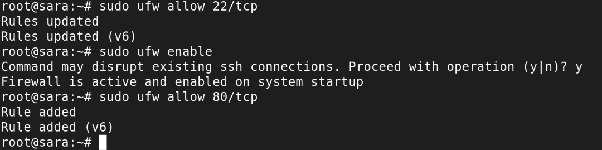
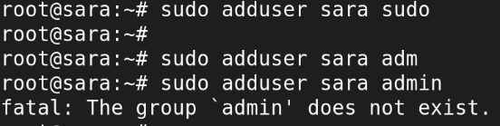
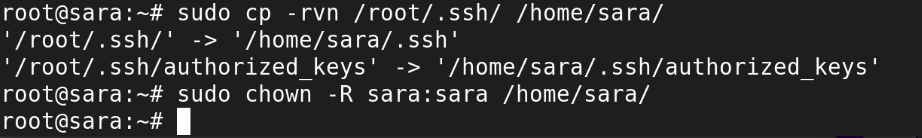
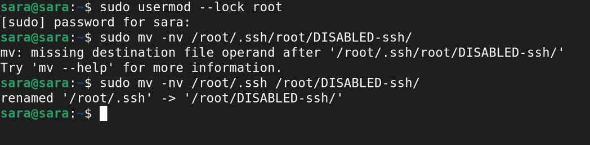
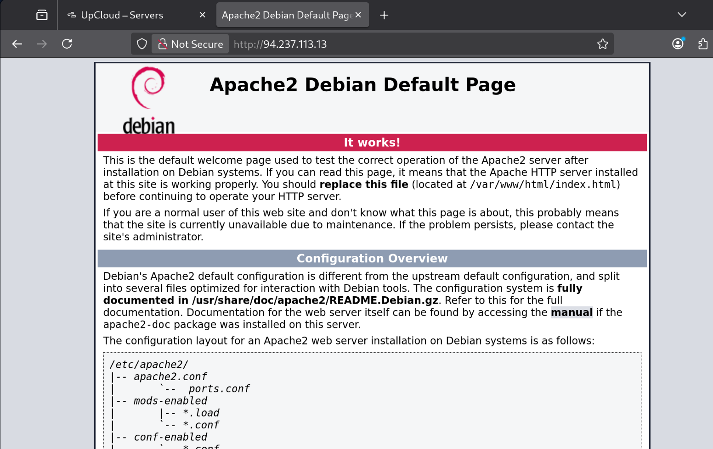
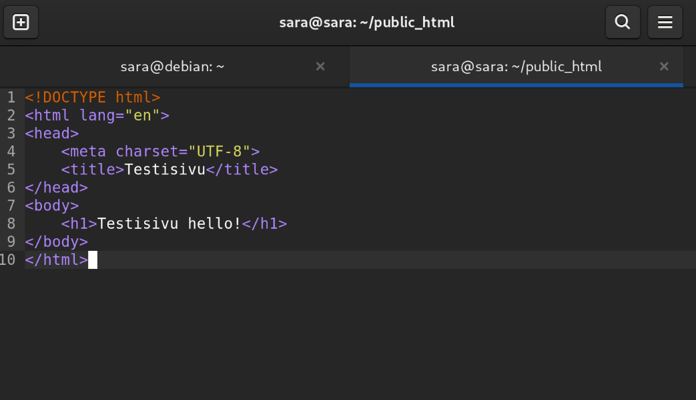
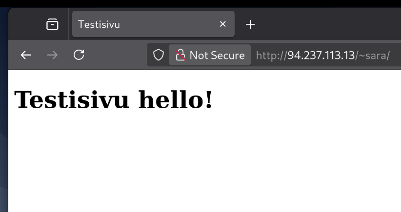

# H4

[https://susannalehto.fi/2022/teoriasta-kaytantoon-pilvipalvelimen-avulla-h4/](https://susannalehto.fi/2022/teoriasta-kaytantoon-pilvipalvelimen-avulla-h4/)
- Artikkelin aiheena oli toisen opiskelijan versio tehtävistä. Tehtävissä oli tarkat ohjeet pilvipalvelimen vuokraukseen, asennukseen, suojaukseen ja päivityksiin.
- Tehtävissä näytettiin mm. palomuurin asennus ja se, miten yksinkertaiset kotisivut julkaistaan. Artikkelissa näytettiin myös pilvipalvelun vuokraus toiselta yritykseltä kuin mitä itse valitsin omiin tehtäviini.

[https://terokarvinen.com/2017/first-steps-on-a-new-virtual-private-server-an-example-on-digitalocean/](https://terokarvinen.com/2017/first-steps-on-a-new-virtual-private-server-an-example-on-digitalocean/)
- Artikkeli kertoo ohjeet virtuaalipalvelimen luomiseen sekä ohjeet tarvittaviin komentoihin mm. palomuuriin, sudo-käyttäjän luomiseen sekä rootin sulkemiseen.
- Artikkelissa kerrotaan myös ilmaisen domainin luomisesta GitHub Educationin avulla.

## a)

Hankin virtuaalipalvelimeni UpCloudilta viime tunnin aikana, tunnilla näytettyjen ohjeiden mukaan. Otin halvimman mahdollisen paketin ja onnistuin saamaan kuukauden ilmaisen kokeilujakson 250 euron saldolla.

## b)

Kirjaudun palvelimelleni komennolla ssh root@. Latasin ufw:n komennolla sudo apt install ufw. Firewall kuntoon komennoilla sudo ufw allow 22/tcp ja sudo ufw enable ja sudo ufw allow 80/tcp.

Loin uuden käyttäjän komennolla sudo adduser, lisäsin sudoon ja adm (sudo adduser sudo ja sudo adduser adm). Sudo adduser admin ei toiminut mutta se oli ilmeisesti ok.

En päässyt vielä kirjautumaan ilman SSH:ta käyttäjätunnuksessa, joten laitoin sen kuntoon komennoilla sudo cp -rvn /root/.ssh/ /home/sara/ ja sudo chown -R sara:sara /home/sara/

Nyt pääsin kirjautumaan käyttäjätunnuksellani. Rootin sulkeminen komennoilla  sudo usermod --lock root ja sudo mv -nv /root/.ssh /root/DISABLED-ssh/.

Päivityksien tekeminen komennoilla sudo apt-get update, sudo apt-get upgrade ja sudo systemctl reboot.

## c)

Asensin Apachen palvelimelle komennoilla sudo apt-get install apache2 ja sudo systemctl status apache2.

Kokeilin, ja Apache2 aloitusivu näkyi ip-osoitteessa:

Korvasin etusivun ja tarkistin että näkyy myös puhelimella komennolla echo testi | sudo tee /var/www/html/index.html

Etusivun tekeminen, komennot sudo a2enmod userdir ja sudo service apache2 restart alkuun. Sitten tein kansion public_html. Asensin micron komennolla sudo apt-get install micro ja tein perus html-sivun index.html public_html kansioon;

En saanut vielä näkymään tätä sivustolla joten tämä kohta jäi vielä auki.

## EDIT: 10.2.2026
Sain erittäin hyvän palautteen, missä oli vinkkejä ongelman korjaamiseen. Kokeilin vielä ennen tunnin alkua suorittaa komennot: chmod 755 /home/sara, chmod 755 /home/sara/public_html, chmod 644 /home/sara/public_html/index.html joilla sain etusivun toimimaan;

## LÄHTEET

Karvinen, Tero 19.9.2017: First Steps on a New Virtual Private Server – an Example on DigitalOcean and Ubuntu 16.04 LTS. Luettu 8.2.2026.
[https://terokarvinen.com/2017/first-steps-on-a-new-virtual-private-server-an-example-on-digitalocean/](https://terokarvinen.com/2017/first-steps-on-a-new-virtual-private-server-an-example-on-digitalocean/)

Lehto, Susanna 14.2.2022: Teoriasta käytäntöön pilvipalvelimen avulla (h4). Luettu 8.2.2026.
[https://susannalehto.fi/2022/teoriasta-kaytantoon-pilvipalvelimen-avulla-h4/](https://susannalehto.fi/2022/teoriasta-kaytantoon-pilvipalvelimen-avulla-h4/)

Karvinen, Tero. Linux Palvelimet 2026. Luettu 8.2.2026.
[https://terokarvinen.com/linux-palvelimet/](https://terokarvinen.com/linux-palvelimet/)
