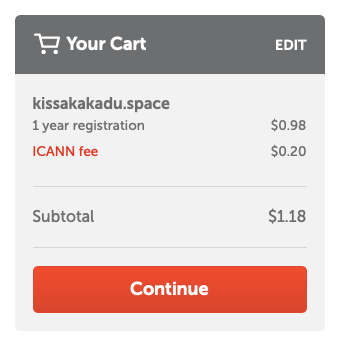
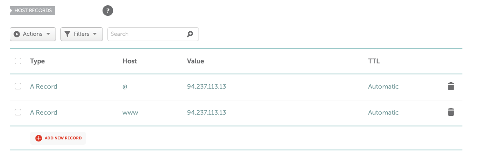
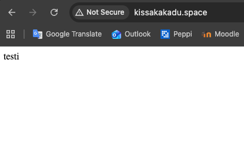
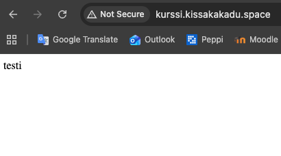
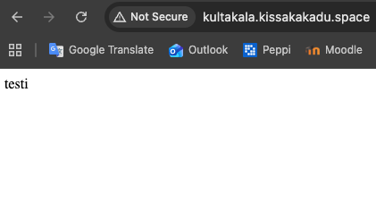
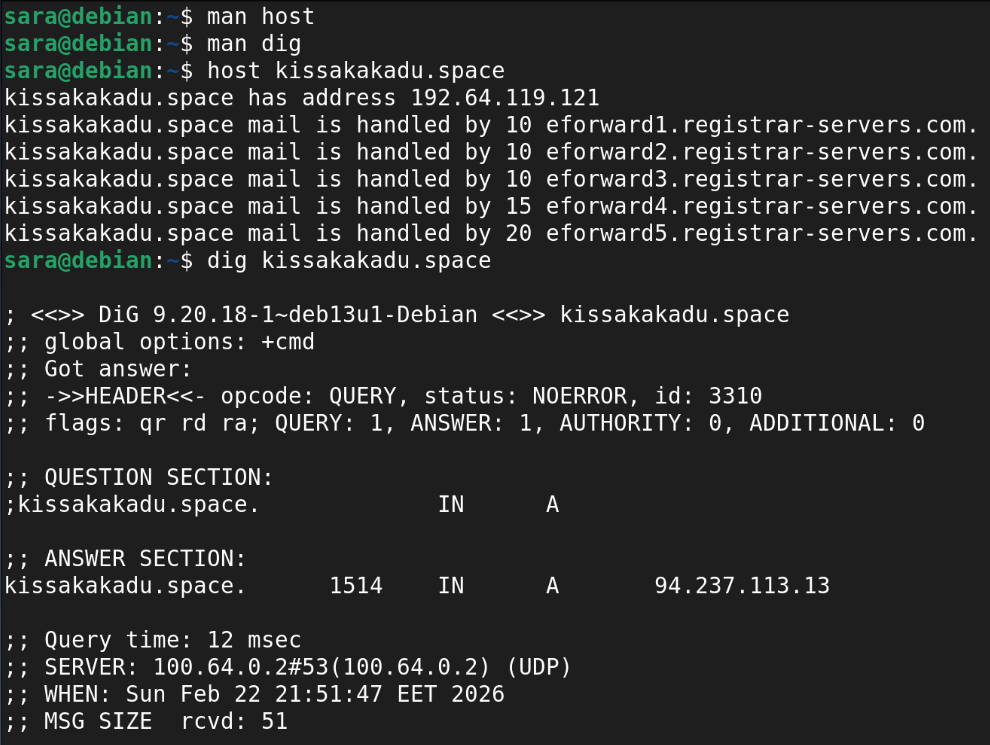
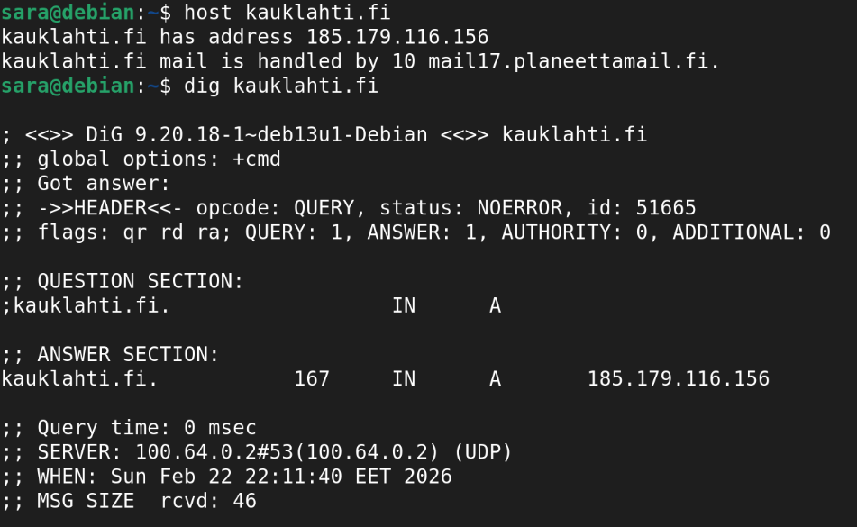
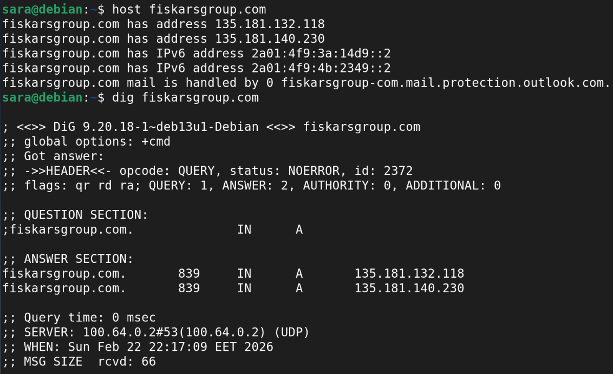

# H5

## a)

Ostin namecheapilta domainin. Ostin halvimman mahdollisen ja päädyin space-päätteeseen, joka maksoi vuodeksi noin yhden euron.

Sitten laitoin uuden domainin osoittamaan palvelimelle. Asetin namecheapin Advanced DNS -asetuksista A Record palvelimen ip-osoitteeseen. Käytin lähteenä namecheapin sivustolta löytyviä ohjeita, jotka olivat kattavat ja näistä kävivät myös ilmi yleisimmät virhetilanteet.

Muutaman minuutin kuluttua totesin yhdistyksen onnistuneen.

## b)

Seuraavaksi oli vuorossa alidomainien tekeminen. Tähän käytin myös ohjetta, joka löytyi namecheapin sivustolta. Tällöin hostiksi merkitään alidomainin teksti, esimerkiksi kurssi.

## c)

Ensin syötin komennot man host ja man dig ja selasin manuaalit läpi, jotta saisin luettua datan selkeämmin raporteista.

### - Oma domain-nimi (kissakakadu.space)

host-komento näyttää ip-osoitteen ja sähköpostipalvelimen. Ip-osoite on eri kuin namecheapilla näkyvä. dig-komento näyttää esimerkiksi, että status on ilman erroreita (NOERROR) ja että palvelin vastaa mistä ip-osoitteesta. Tämä osoite on sama kuin namecheapilla. Myös kyselyn aika kerrotaan kauanko kesti, mikä serveri, kyselyn ajankohta ja vastauksen koko.

### - Pienet sivut (kauklahti.fi)

host-komento näyttää ip-osoitteen ja sähköpostipalvelimen. dig-komento näyttää ei erroreita, ip-osoitteen, nopean vastausajan, serverin, ajankohdan ja vastauksen koon. En erota paljoa omasta domainistani erottuvia tietoja.

### - Suuret sivut (fiskarsgroup.com)

host-komento näyttää kaksi ip4-osoitetta sekä kaksi ip6-osoitetta. Näiden lisäksi sähköpostipalvelimena näkyy outlook. dig-komento näyttää no error sekä vastauksia kaksi, kun aikaisemmissa se oli yksi, ilmeisesti johtuen kahdesta ip-osoitteesta. Tämä on suurin ero pienempiin sivuihin verrattuna. Uskon, että tähän vaikuttaa sivuston suurempi koko ja kävijämäärä.

## Lähteet:

Namecheap Support 2024: *How can I set up an A (address) record for my domain?* Namecheap Knowledgebase. Luettu 22.2.2026.
[https://www.namecheap.com/support/knowledgebase/article.aspx/319/2237/how-can-i-set-up-an-a-address-record-for-my-domain/](https://www.namecheap.com/support/knowledgebase/article.aspx/319/2237/how-can-i-set-up-an-a-address-record-for-my-domain?utm_source=chatgpt.com)
