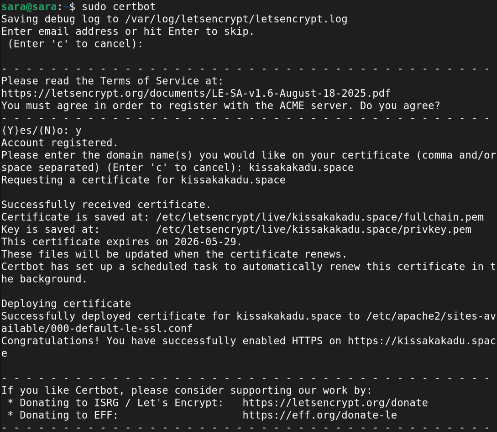
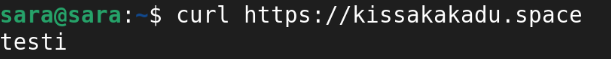
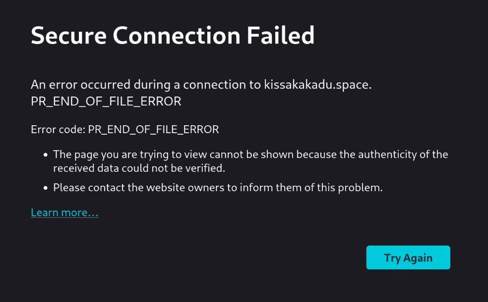
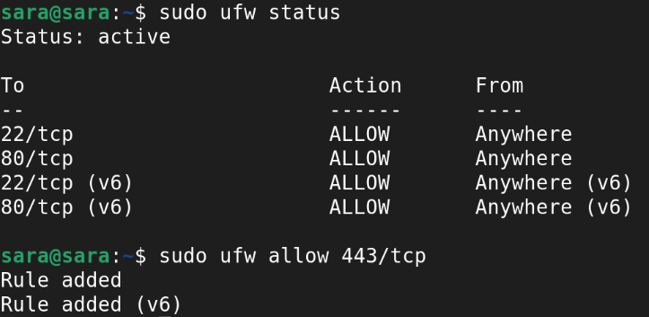
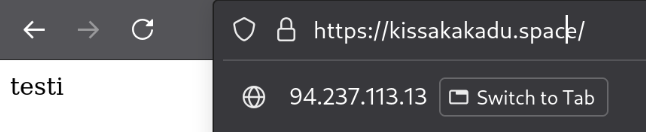
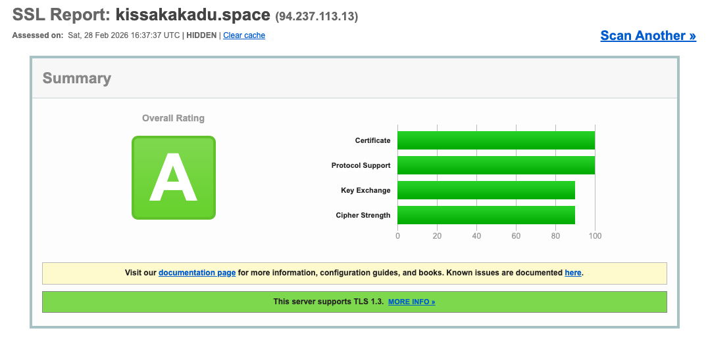

# H6

## x)

[https://letsencrypt.org/how-it-works/](https://letsencrypt.org/how-it-works/)
- Artikkelissa kerrotaan, kuinka Let's Encrypt ja ACME protokolla mahdollistavat https-sertifikaatin käyttöönoton.
- Julkisella avaimella ACME-asiakas tunnistautuu ja todistaa domainin hallinnoimisen.
- Tämä tehdään esim. DNS-tietueella tai luomalla http-resurssi osoitteeseen.

[https://httpd.apache.org/docs/2.4/ssl/ssl_howto.html#configexample](https://httpd.apache.org/docs/2.4/ssl/ssl_howto.html#configexample)
- Artikkelissa näytetään esimerkki Apache-palvelimen SSL-määrityksistä.
- Esimerkissä on esim. https-portin kuuntelu (443) ja tiedostopolut VirtualHostissa.

## a)

Kirjauduin ensin palvelimelleni sisään, sitten tein komennon sudo apt update ja asensin certbotin komennoilla sudo apt install certbot ja sudo apt install python3-certbot-apache.

Sitten tein komennon sudo certbot aktivoidakseni sen. Kaikki näytti sujuvan hyvin:

Komento curl https://kissakakadu.space näyttää sivun sisällön oikein:

Mutta selaimessa tulee vielä error:

Mutta sehän johtuu siitä, ettei porttia 443 ole vielä avattu. Joten tein komennon sudo ufw status varmistaakseni asian, sekä sudo ufw allow 443/tcp avatakseni sen:

Ja nyt sivuston https:// osoite toimiikin jo moitteettomasti:

## b)

[Tein SSLLabs raportin](https://www.ssllabs.com/). Sain A-tuloksen sivustolleni:

## Lähteet

- ChatGPT 2026: Termien kääntäminen suomeksi. OpenAI ChatGPT, haettu 28.2.2026.
- Karvinen, Tero 2026: Linux‑palvelimet – h6 Salataampa. Terokarvinen.com, haettu 28.2.2026. (https://terokarvinen.com/linux-palvelimet/#h6-salataampa)[https://terokarvinen.com/linux-palvelimet/#h6-salataampa]
- Linux-palvelimet kurssi 2026: Screenshot viime tunnilla käsitellyistä terminal-komennoista, haettu 28.2.2026.
