# H7

## a)

Ensimmäisenä vuorossa on "Hello World" tekstin esittäminen terminaalissa kolmella eri kielellä. 

Aloitin pythonista. Loin ensin kansion pythonhello jonka sisään tein tiedoston helloworld.py. Tiedostoon kirjoitin pythonilla "Hello World" ja komennolla python3 helloworld.py tiedoston sisältö tulostuu terminaaliin:

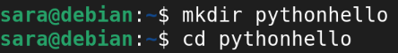
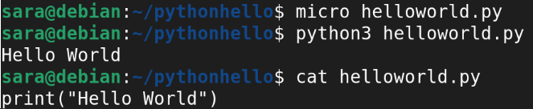

Seuraavaksi tein javalla. Ensin loin kansion javahello jonka sisään tein tiedoston helloworld.java. Huomasin, ettei javaa ole vielä asennettu, joten asensin sen ensin.

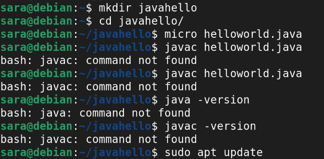

Tarkistin että asennus onnistui tsekkaamalla javaversion. Sitten yritin kääntää javatiedoston, mutta se ei onnistunut, koska minulla oli pari kirjoitusvirhettä koodissa:

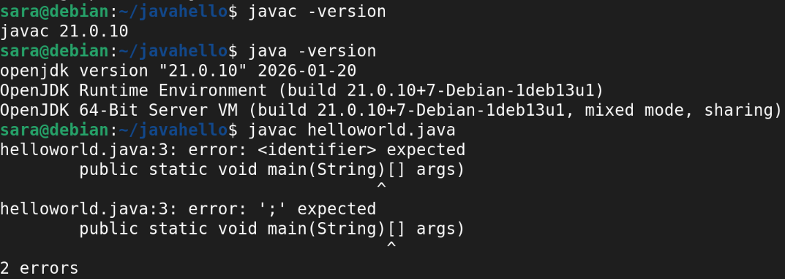

Korjasin virheet ja yritin kääntää uudestaan. Nyt onnistui, ja huomasin helloworld.class tiedoston löytyvän kansiosta. Nyt kun ajoin koodin, se tulosti "Hello World" terminaaliin kuten pitää:

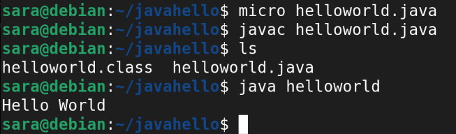

Tässä vielä korjattu, toimiva javakoodi:

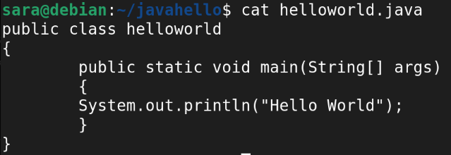

Sitten vielä sama C-kielellä. Ensin loin kansion chello jonka sisään tein tiedoston helloworld.c. Käänsin tiedoston, yritin tulostaa väärää tiedostoa, koska unohdin että vakiotiedostonimi on a.out jos en nimeä tiedostoa. Sitten tarkistin tiedostonimen ja yritin tulostaa sen vahindossa vääräällä päätteellä. Sitten tulostus onnistui:

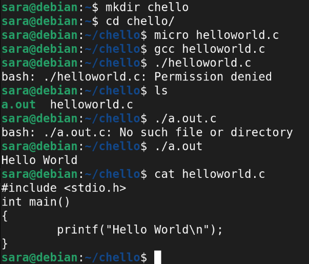

## c)

Uuden komennon luominen Linuxiin. Päätin tehdä komennon, jolla käyttäjä näkee kellonajan Japanissa. Aloitin tekemällä tiedoston timeinjapan.sh. Loin tämän vahingossa edellisessä tehtävässä auki jääneeseen kansioon, joten poistuin kansiosta, tein uuden ja siirsin tiedoston ensin sinne. Tämän jälkeen tein oikeudet kaikille käyttäjille, että he voivat ajaa komentoa. Tämän jälkeen testasin komentoa, ja se toimi odotetusti:

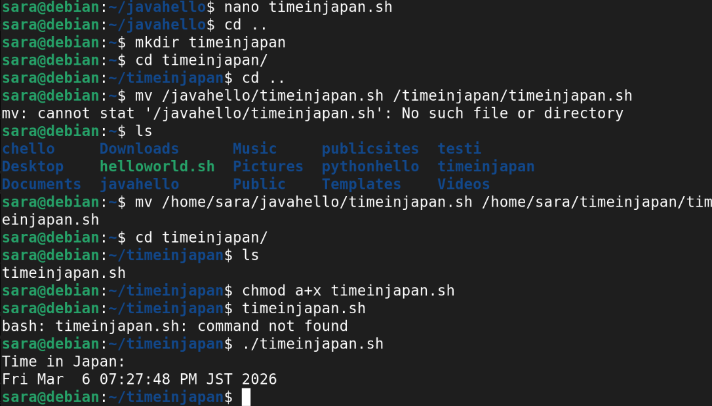

Kuva vielä komennon sisällöstä:

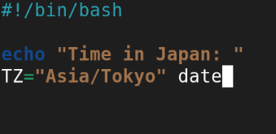

Ja melkein unohtui, kopioidaanpa vielä tiedosto kaikkien saataville (ja poistetaan tiedostopääte):

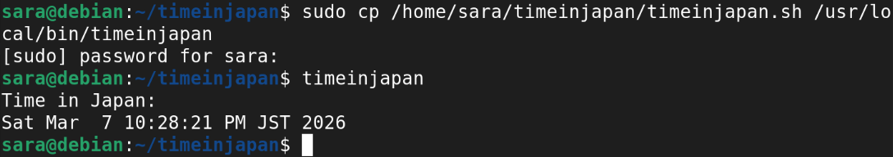

## d)

Käytin tätä vanhaa laboratorioharjoitusta: [https://terokarvinen.com/2023/linux-palvelimet-2023-arvioitava-laboratorioharjoitus/](https://terokarvinen.com/2023/linux-palvelimet-2023-arvioitava-laboratorioharjoitus/)

Tehtävänanto:
d) Tee kaikkien käyttäjien käyttöön komento 'hey'. Tulosta haluamaasi ajankohtaista tietoa, esim päivämäärä, koneen osoite tms. Komennon tulee toimia kaikilla käyttäjillä työhakemistosta riippumatta.

Tässä miten suoritin tehtävän ja komennon sisältö ja suorittamisen tulos:

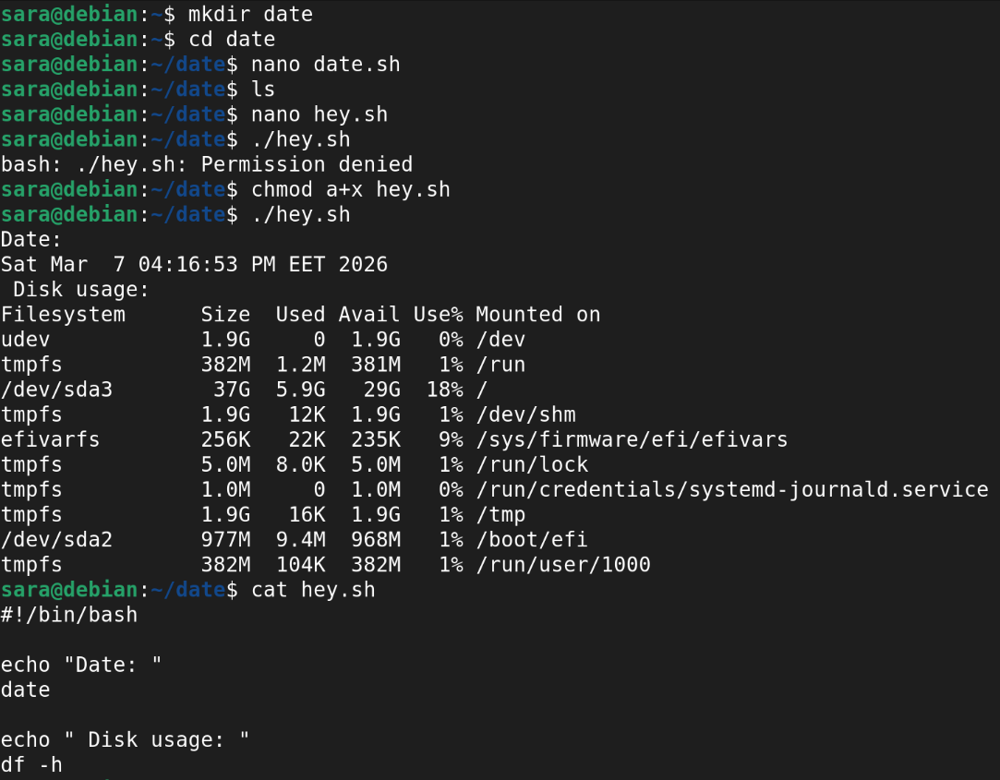
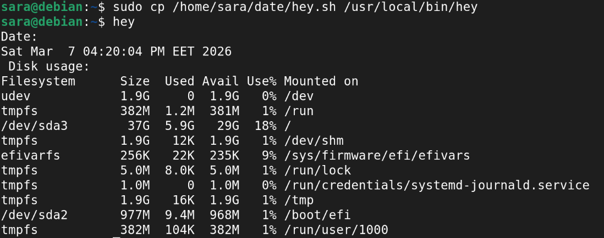

## Lähteet

- Karvinen, Tero 2026: Linux Palvelimet – Maalisuora (h7). Terokarvinen.com, luettu 6.3.2026. [https://terokarvinen.com/linux-palvelimet/#h7-maalisuora](https://terokarvinen.com/linux-palvelimet/#h7-maalisuora)
- Karvinen, Tero 2018: Hello World Python3, Bash, C, C++, Go, Lua, Ruby, Java – Programming Languages on Ubuntu 18.04. Terokarvinen.com, julkaistu 27.9.2018, luettu 6.3.2026. [https://terokarvinen.com/2018/hello-python3-bash-c-c-go-lua-ruby-java-programming-languages-on-ubuntu-18-04/](https://terokarvinen.com/2018/hello-python3-bash-c-c-go-lua-ruby-java-programming-languages-on-ubuntu-18-04/)
- Karvinen, Tero 2007: Shell Scripting – Shell Scripting 4. Terokarvinen.com, julkaistu 4.12.2007, luettu 7.3.2026. [https://terokarvinen.com/2007/12/04/shell-scripting-4/](https://terokarvinen.com/2007/12/04/shell-scripting-4/)
- ChatGPT 2026: Keskustelu siitä, miten saadaan komento, jossa aika eri timezonessa. OpenAI ChatGPT, haettu 7.3.2026.
- Karvinen, Tero 2023: Final Lab for Linux Palvelimet 2023 – arvioitava laboratorioharjoitus. Terokarvinen.com, julkaistu 17.3.2023, luettu 7.3.2026. [https://terokarvinen.com/2023/linux-palvelimet-2023-arvioitava-laboratorioharjoitus/](https://terokarvinen.com/2023/linux-palvelimet-2023-arvioitava-laboratorioharjoitus/)
